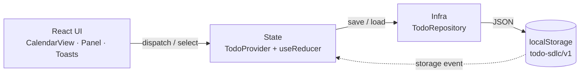
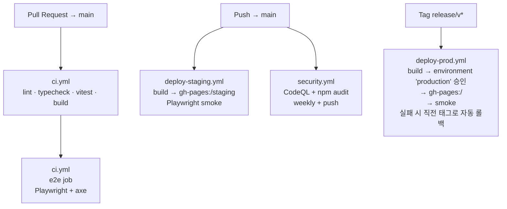

# todo-sdlc

[](https://github.com/ischung/todo-sdlc/actions/workflows/ci.yml)
[](https://github.com/ischung/todo-sdlc/actions/workflows/deploy-staging.yml)
[](https://github.com/ischung/todo-sdlc/actions/workflows/security.yml)
[](https://ischung.github.io/todo-sdlc/staging/)

대학생/취준생을 위한 **개인용 달력 Todo 앱** — SDLC 실습 프로젝트 (PRD → TechSpec → Vertical Slice + CI/CD-first).

> 🌐 **Live**:
> Staging: <https://ischung.github.io/todo-sdlc/staging/>
> Production: <https://ischung.github.io/todo-sdlc/> *(release/v\* 태그 + 수동 승인 후 갱신)*

---

## 스택

- **Frontend** — React 18 + TypeScript 5.4 + Vite 5
- **Style** — TailwindCSS 3 (디자인 토큰: `brand` / `surface` / `ink`)
- **Persistence** — Browser `localStorage` 단일 키 `todo-sdlc/v1` (백엔드 없음)
- **Test** — Vitest + React Testing Library (단위/통합) · Playwright (smoke·E2E·a11y)
- **CI/CD** — GitHub Actions + GitHub Pages (gh-pages 브랜치)

## 아키텍처 (요약)



- 단일 도메인 트리(`PersistRoot.todosByDate`) — 날짜별 O(1) 조회.
- 모든 변형 액션은 `Repository.save → dispatch` 순서로 수행되어 영속이 화면 갱신보다 먼저 끝난다.
- 다른 탭의 `storage` 이벤트가 들어오면 LOAD 가 재실행돼 자동 동기화된다.

자세한 설계는 [`techspec.md`](./techspec.md) 참고.

---

## 로컬 실행

```bash
npm install
npm run dev          # 개발 서버 (http://localhost:5173)
```

가장 빠른 사용 흐름은 [`docs/USER_GUIDE.md`](./docs/USER_GUIDE.md) 를 보세요.

## 스크립트

| Script | 설명 |
| :---- | :---- |
| `npm run dev` | Vite 개발 서버 (port 5173) |
| `npm run build` | 프로덕션 빌드 (`tsc -b && vite build`) |
| `npm run build:staging` | 스테이징 빌드 (`base=/todo-sdlc/staging/`) |
| `npm run build:production` | 프로덕션 빌드 (`base=/todo-sdlc/`) |
| `npm run preview` | 빌드 산출물 미리보기 |
| `npm run lint` | ESLint (warning 0 강제) |
| `npm run typecheck` | TypeScript `--noEmit` |
| `npm run test` | Vitest (단위·통합) |
| `npm run test:smoke` | Playwright smoke (스테이징 URL 또는 로컬 preview) |
| `npm run test:e2e` | Playwright E2E (`tests/e2e/` · F1~F8 + a11y) |
| `npm run format` | Prettier 일괄 포맷 |

---

## CI/CD 파이프라인 한눈에



- 워크플로 정의: [`.github/workflows/`](./.github/workflows/)
- 한 번만 수동 실행하는 스크립트: [`scripts/`](./scripts/) — `setup-github-pages.sh`, `setup-branch-protection.sh`, `setup-prod-environment.sh`
- 운영 절차/롤백/장애 대응: [`docs/RUNBOOK.md`](./docs/RUNBOOK.md)

---

## 기여 규칙

- main 브랜치 직접 푸시 금지 → feature 브랜치 + PR
- PR 은 `ci` 워크플로(lint/typecheck/test/build) + `e2e` 잡이 초록불이어야 머지 가능
- 코드 소유자 자동 리뷰 요청: [`.github/CODEOWNERS`](./.github/CODEOWNERS)

---

## 문서

| 문서 | 용도 |
| :---- | :---- |
| [`prd.md`](./prd.md) | 제품 요구사항 (What/Why) |
| [`techspec.md`](./techspec.md) | 기술 명세 (How) — 아키텍처/타입/API/스타일 토큰 |
| [`issues-vertical.md`](./issues-vertical.md) | 이슈 분할 (Vertical Slice + CI/CD-first) |
| [`docs/USER_GUIDE.md`](./docs/USER_GUIDE.md) | 첫 사용자 5분 가이드 (스크린샷 포함) |
| [`docs/RUNBOOK.md`](./docs/RUNBOOK.md) | 운영 런북 — 배포·롤백·장애 대응 |
