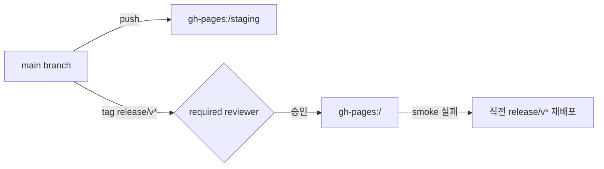

# 운영 런북 (Runbook)

todo-sdlc 의 배포·롤백·장애 대응 절차를 한 곳에 모았습니다. 이 문서는 사람이 따라 읽고 그대로 실행할 수 있도록 구성되어 있습니다.

---

## 1. 환경 지도

| 환경 | URL | 트리거 | 워크플로 | 보호 |
| :---- | :---- | :---- | :---- | :---- |
| Staging | <https://ischung.github.io/todo-sdlc/staging/> | `main` 푸시 | `.github/workflows/deploy-staging.yml` | concurrency cancel + smoke |
| Production | <https://ischung.github.io/todo-sdlc/> | `release/v*` 태그 | `.github/workflows/deploy-prod.yml` | GitHub Environment 승인 게이트 + smoke + 자동 롤백 |



---

## 2. 일상 배포 — Staging

스테이징은 자동입니다. 직접 할 일은 없습니다.

1. `feature/...` 브랜치에서 작업.
2. PR 생성 → ci 잡(`lint · typecheck · test · build`) + e2e 잡 그린 확인.
3. `main` 머지 → `deploy-staging.yml` 자동 실행.
4. 워크플로 마지막 단계의 `::notice` 메시지에 스테이징 URL 이 출력됩니다.
5. 배포 직후 Playwright smoke 가 같은 URL 에 대해 자동 실행. 실패 시 워크플로 빨간불.

상태 확인: 리포 → Actions → `deploy-staging`.

---

## 3. 프로덕션 배포 — release 태그

```bash
# 0) 최초 1회: production 환경 + required reviewer 등록
bash scripts/setup-prod-environment.sh

# 1) main 이 안정적인지 확인 (e2e 그린 / staging smoke 그린)
git checkout main && git pull --ff-only

# 2) 릴리스 태그 생성 (Semver)
git tag release/v0.1.0
git push origin release/v0.1.0

# 3) Actions 탭 → deploy-prod 워크플로 → 'production' 환경 승인 버튼
# 4) 승인 후 ~3-5분 내 https://ischung.github.io/todo-sdlc/ 갱신
```

워크플로 단계: `build` → `deploy (환경 승인 게이트)` → `smoke` → 실패 시 `rollback`.

### Hotfix

```bash
git checkout -b fix/<짧은-요약>
# 패치 후
git push -u origin fix/<짧은-요약>   # PR 생성 → main 머지
git tag release/v0.1.1               # 즉시 새 릴리스 태그
git push origin release/v0.1.1
# Actions 에서 승인
```

---

## 4. 롤백

### 자동 롤백 (smoke 실패 시)

`deploy-prod.yml` 의 `rollback` 잡이 직전 `release/v*` 태그를 다시 빌드해 gh-pages 루트에 덮어씁니다. 별도 조치는 불필요하며 워크플로의 `::warning` 알림으로 인지합니다.

### 수동 롤백 (이미 라이브 상태가 이상할 때)

```bash
# 1) 직전 안정 태그 확인
git tag -l 'release/v*' --sort=-creatordate | head

# 2) workflow_dispatch 로 deploy-prod 재실행 (해당 SHA/태그 선택)
gh workflow run deploy-prod.yml --ref release/v0.1.0
```

또는 Actions 탭의 `deploy-prod` → "Run workflow" 버튼으로 원하는 태그 선택.

---

## 5. 1회용 거버넌스 스크립트

| 스크립트 | 언제 |
| :---- | :---- |
| `scripts/setup-github-pages.sh` | Pages 활성화(소스: gh-pages 브랜치 루트) — 리포 생성 직후 1회 |
| `scripts/setup-branch-protection.sh` | main 직접 푸시 차단 + ci 통과 강제 — 리포 생성 직후 1회 |
| `scripts/setup-prod-environment.sh` | production 환경 + required reviewer 1명 등록 — 프로덕션 첫 배포 전 1회 |

모두 멱등적이며 다시 실행해도 안전합니다.

---

## 6. 보안

- `.github/workflows/security.yml` 가 매 push + 매주 토요일에 CodeQL + `npm audit` 를 실행합니다.
- `npm audit` 는 high/critical 만 빨간불로 잡고, moderate 는 워크플로 요약에만 노출합니다.
- 빨간불 처리 순서: 의존성 업데이트 → 영향 범위 확인 → 패치 PR + 핫픽스 태그.

---

## 7. 자주 나는 이슈 5가지

### 7.1 staging URL 이 404

- 원인: GitHub Pages 가 `gh-pages` 브랜치를 source 로 보고 있지 않거나, 첫 배포가 아직 propagate 되지 않음.
- 조치: `bash scripts/setup-github-pages.sh` 1회 실행, 또는 Settings → Pages 에서 source 확인 후 1~2 분 대기.

### 7.2 deploy-staging 의 smoke 가 빨간불

- 원인 후보: ① smoke 셀렉터가 컴포넌트 변경에 뒤따라가지 못함, ② 배포가 아직 propagate 되지 않아 404.
- 조치: 워크플로의 `Wait for Pages propagation` 단계 로그 확인. 셀렉터는 `tests/smoke/` 와 컴포넌트의 `aria-current` / `data-testid` 를 동기화.

### 7.3 PR e2e 잡의 axe 위반

- 원인 후보: 새 인터랙티브 요소에 `aria-label`/`role` 누락, Tailwind 토큰이 컴파일에 emit 되지 않아 흰 글씨가 흰 배경 위에 노출(예: 팔레트에 없는 단계의 `bg-brand-NNN`).
- 조치: HTML 리포트 artifact(`playwright-e2e-report`)의 violation 노드를 보고 색·역할 보강. 색은 4.5:1 이상 보장.

### 7.4 데이터가 사라진 것 같다는 사용자 제보

- 원인 후보: 시크릿 모드, 브라우저 저장소 정리, 다른 도메인(스테이징 ↔ 프로덕션 사이) 혼동.
- 조치: 같은 origin 에서 `localStorage['todo-sdlc/v1']` 가 비어있는지 확인. 손상된 JSON 일 경우 자동으로 `todo-sdlc/v1.bak` 백업 후 빈 트리로 재시작.

### 7.5 production 배포가 승인 단계에서 멈춰있음

- 원인: 환경 보호 규칙에 등록된 required reviewer 가 다른 사람이라 알림을 못 봤거나, 환경 자체가 미설정.
- 조치: `gh api /repos/ischung/todo-sdlc/environments/production` 로 reviewer 확인. 없으면 `bash scripts/setup-prod-environment.sh` 재실행.

---

## 8. 관측·모니터링 (간이)

이 프로젝트는 백엔드가 없어 별도 APM 이 없습니다. 대신:

- **Actions 알림** — 빨간불 시 `::warning` / `::notice` 가 PR 또는 머지 커밋에 표시.
- **수동 헬스체크** — `curl -fsS https://ischung.github.io/todo-sdlc/staging/ -o /dev/null -w "%{http_code}\n"`.
- **사용자 제보 채널** — README 의 이슈 탭.

향후 확장: Sentry/PostHog 같은 클라이언트 전용 SDK 를 붙이면 됩니다 (TechSpec §7 후속 과제).
