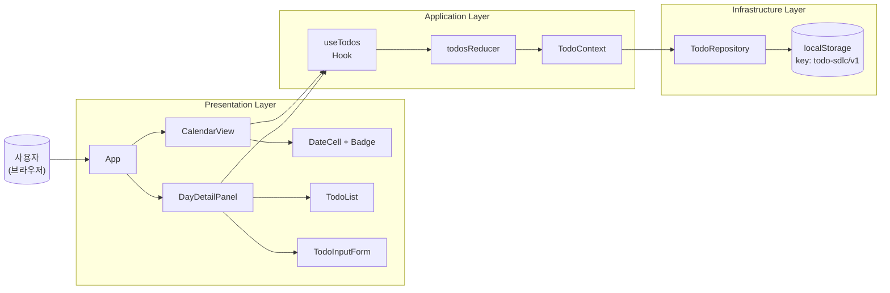
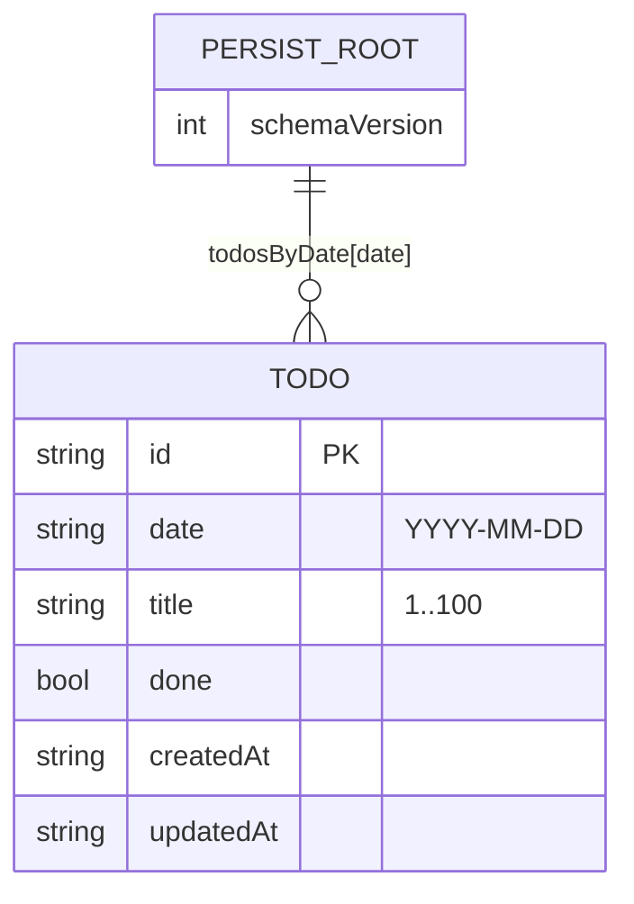
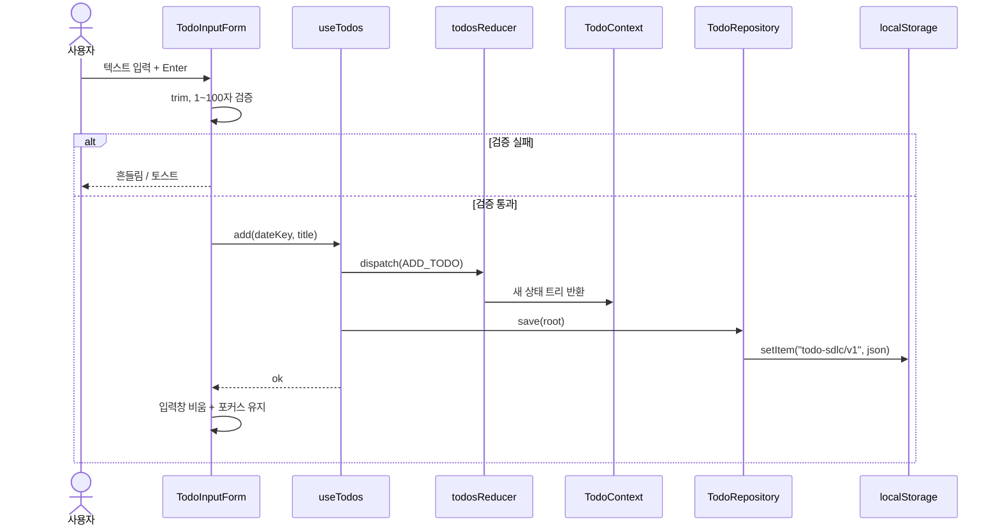

# Tech Spec: 개인용 달력 Todo 앱

---

## 1. 문서 정보

| 항목 | 내용 |
|------|------|
| **작성일** | 2026-04-27 |
| **상태** | Draft |
| **버전** | v0.1 |
| **원문 PRD** | `prd.md` |
| **작성자** | insang |

---

## 2. 시스템 아키텍처

### 2-1. 아키텍처 패턴

| 패턴 | 선택 이유 |
|------|-----------|
| **Client-only SPA** (백엔드 없음) | PRD의 영속 저장 요건이 "브라우저 한정 로컬 보존"이고, 다중 사용자/동기화가 Out-of-Scope이므로 서버를 두지 않는 것이 가장 단순하고 비용 효율적 |
| **Layered Architecture** (UI → Application(Hook) → Repository) | 책임 분리로 localStorage 의존을 한 곳에 격리. 추후 IndexedDB·서버 동기화로 교체 시 Repository 인터페이스만 갈아끼우면 됨 |
| **State: React Context + useReducer** | 단일 사용자/단일 페이지 규모에서 Redux·Zustand 등 외부 라이브러리 도입 비용 ↑. 표준 React API로 충분하고 학습 비용 0 |

### 2-2. 컴포넌트 구성도 (Mermaid)



### 2-3. 배포 환경

| 환경 | 호스팅 | 비고 |
|------|--------|------|
| Frontend | GitHub Pages 또는 Vercel/Netlify | 정적 SPA, 무료 티어로 충분 |
| Backend | **없음** | Client-only |
| Database | **localStorage** (브라우저) | 동기화·백업 없음 (PRD Out-of-Scope) |
| CI/CD | GitHub Actions | lint → test → build → deploy |

---

## 3. 기술 스택

| 분류 | 기술 | 버전 | 선정 이유 |
|------|------|------|-----------|
| 언어 | TypeScript | ^5.4 | 데이터 모델 명세성·리팩터링 안전성. PRD에 100자 제한·Date 처리 등 타입 강제 가치 ↑ |
| UI 프레임워크 | React | ^18.3 | 사용자 지정. 함수형 컴포넌트 + Hooks 표준 |
| 빌드 도구 | Vite | ^5.x | 빠른 dev 서버 + 표준 빌드. CRA보다 가볍고 교육적으로 구조 파악 용이 |
| 스타일 | TailwindCSS | ^3.4 | 사용자 지정. 디자인 토큰을 `tailwind.config.js`로 일원화 |
| 상태 관리 | React Context + useReducer | (React 내장) | 외부 라이브러리 도입 부담 회피. 단일 도메인 규모에 충분 |
| 영속 저장 | Web Storage API (`localStorage`) | (브라우저 내장) | 사용자 지정. 동기 API라 단순 |
| 날짜 처리 | `date-fns` | ^3.x | 트리쉐이킹 가능, moment 대비 가벼움 (`format`, `addMonths`, `startOfMonth`, `eachDayOfInterval`만 사용) |
| 단위/통합 테스트 | Vitest + React Testing Library | ^1.x / ^14.x | Vite 친화적, Jest 호환 API |
| E2E 테스트 | Playwright | ^1.x | UI 회귀 테스트 (PRD F1~F8 시나리오) |
| 린트/포맷 | ESLint + Prettier | ^8.x / ^3.x | CI 게이트 |
| ID 생성 | `crypto.randomUUID()` | (브라우저 내장) | 외부 라이브러리 불필요 |

---

## 4. 데이터 모델

### 4-1. 도메인 엔티티 (TypeScript)

```ts
// src/domain/types.ts

/** ISO 날짜 문자열 (YYYY-MM-DD). 시각 정보는 포함하지 않는다. */
export type DateKey = string;

export interface Todo {
  /** 안정 식별자 (crypto.randomUUID) */
  id: string;
  /** 소속 날짜 (YYYY-MM-DD) */
  date: DateKey;
  /** 1~100자, 공백 trim 후 비어있지 않음 */
  title: string;
  /** 완료 여부 */
  done: boolean;
  /** 생성 시각 (ISO 8601, ms 정밀) */
  createdAt: string;
  /** 마지막 변경 시각 */
  updatedAt: string;
}

/** localStorage 에 저장되는 루트 스키마 */
export interface PersistRoot {
  /** 스키마 버전. 마이그레이션 분기 키 */
  schemaVersion: 1;
  /** date(YYYY-MM-DD) → Todo[] 인덱스 (조회 O(1), 저장 단순) */
  todosByDate: Record<DateKey, Todo[]>;
}
```

**제약**
- `title`: trim 후 1~100자 (Validation)
- `date`: 항상 `YYYY-MM-DD` 포맷, 로컬 타임존 기준 (자정 경계는 사용자의 시스템 시간 기준)
- `id`: 전역 유일

### 4-2. 데이터 관계 (Mermaid ERD)



### 4-3. localStorage 스키마

| Key | Value | 비고 |
|-----|-------|------|
| `todo-sdlc/v1` | `JSON.stringify(PersistRoot)` | 단일 키. 전체 트리를 한 번에 직렬화/역직렬화 |

> **이유**: 데이터량이 작고(개인용, 일평균 1건) 트랜잭션·키 분할 이점이 거의 없음. 단일 키로 두면 로드/세이브 로직이 단순해지고 일관성도 자동 보장됨.

### 4-4. 마이그레이션 전략

- 진입 시 `schemaVersion` 검사 → 미일치 시 등록된 마이그레이터 체인 실행 → 변환 후 다시 저장
- v1 단계에서는 마이그레이터 없음. 인터페이스만 마련해 향후 v2 추가 시 `migrate(v1 → v2)` 한 줄로 확장

---

## 5. API 명세

> **백엔드가 없으므로 HTTP API 대신, Application Layer가 노출하는 "내부 서비스 API" 를 정의한다.**
> 향후 서버 도입 시 동일 시그니처로 REST 엔드포인트로 승격한다.

### 5-1. 공통 결과 형식

```ts
type Result<T> =
  | { ok: true;  data: T }
  | { ok: false; error: { code: string; message: string } };
```

### 5-2. Repository 인터페이스 (Infrastructure Layer)

| 메서드 | 시그니처 | 설명 |
|--------|----------|------|
| `load` | `() => Result<PersistRoot>` | 진입 시 1회 호출. 파싱 실패 시 빈 트리로 복구 |
| `save` | `(root: PersistRoot) => Result<void>` | 매 변경 시 동기 저장. QuotaExceeded 처리 |

### 5-3. Application Service (Hook이 호출)

| 메서드 | 시그니처 | 비즈니스 규칙 |
|--------|----------|---------------|
| `listByDate` | `(date: DateKey) => Todo[]` | 정렬: `createdAt ASC` |
| `countByDate` | `(date: DateKey) => number` | 미완료(`done === false`) 개수만 반환 (배지용) |
| `add` | `(date: DateKey, title: string) => Result<Todo>` | trim → 1~100자 검증 → id 발급 → save |
| `toggle` | `(id: string) => Result<Todo>` | done 반전 → updatedAt 갱신 → save |
| `remove` | `(id: string) => Result<void>` | 인덱스에서 제거 → save. 5초 undo 는 UI 레이어에서 관리 |

### 5-4. 에러 코드

| 코드 | 의미 | UI 메시지 |
|------|------|-----------|
| `VALIDATION_EMPTY_TITLE` | 공백/0자 | (조용히 무시 + 입력창 흔들림) |
| `VALIDATION_TITLE_TOO_LONG` | 100자 초과 | "할 일 제목은 100자 이내로 입력해주세요." |
| `STORAGE_QUOTA_EXCEEDED` | localStorage 용량 초과 | "저장 공간이 가득 찼어요. 오래된 항목을 정리해주세요." |
| `STORAGE_PARSE_ERROR` | JSON 파싱 실패 | "저장된 데이터를 읽지 못했어요. 새로고침 해주세요." |
| `NOT_FOUND` | id 없음 | "이미 삭제된 항목이에요." |

---

## 6. 상세 기능 명세

### 6-1. Frontend

#### 컴포넌트 트리

```
<App>
 ├─ <TodoProvider>                    // Context + useReducer
 │   ├─ <Header>                      // 월 표시, 이전/다음/오늘
 │   ├─ <CalendarView>
 │   │   └─ <DateCell> × N            // 날짜 숫자, 배지, 오늘 강조, 클릭 핸들러
 │   └─ <DayDetailPanel>              // 선택 날짜의 Todo 목록 + 입력
 │       ├─ <TodoInputForm>
 │       └─ <TodoList>
 │           └─ <TodoItem>            // 체크박스, 제목, 삭제
 └─ <UndoToast>                       // 5초 되돌리기
```

#### 핵심 로직 시퀀스 — "할 일 추가"



#### 상태 관리 액션

| Action | Payload | Reducer 처리 |
|--------|---------|--------------|
| `LOAD` | `PersistRoot` | 초기 진입 1회 |
| `ADD` | `Todo` | `todosByDate[date]` 끝에 push |
| `TOGGLE` | `{ id }` | 해당 todo의 `done` 반전, `updatedAt` 갱신 |
| `REMOVE` | `{ id }` | 배열에서 제거, 빈 배열이면 키 삭제 |
| `RESTORE` | `Todo` | undo용 — 원래 위치 인덱스로 재삽입 |

#### 엣지 케이스

| 상황 | 동작 |
|------|------|
| `localStorage` 비활성/시크릿 모드 | `load`가 실패 → 메모리 상태로 동작 + "저장이 비활성화되었어요" 배너 |
| `JSON.parse` 실패 | 빈 트리로 시작 + 원본을 `todo-sdlc/v1.bak` 로 백업 |
| 100자 초과 | 입력 단계에서 maxLength=100 차단 + 시각 피드백 |
| 다른 탭에서 동시 편집 | `storage` 이벤트 구독해 상태 재로드 |
| 시간대 경계(자정) | 진입 시 1회만 `today` 산출. 사용자 인터랙션 시 강조 갱신 안 함 (PRD 단순성 우선) |

### 6-2. Backend

> **해당 사항 없음** — v1은 백엔드를 두지 않는다.
> 향후 다중 기기 동기화 요건이 추가되면 `Repository` 인터페이스를 유지한 채 `RestTodoRepository` 구현체를 추가하고, 동기화 충돌 정책(LWW or vector clock)을 별도 TechSpec 부속서로 정의한다.

---

## 7. UI/UX 스타일 가이드

### 7-1. 디자인 토큰 (Tailwind config 확장)

```js
// tailwind.config.js (요약)
theme: {
  extend: {
    colors: {
      brand:     { 50: '#eef4ff', 500: '#3b82f6', 700: '#1d4ed8' },
      surface:   { DEFAULT: '#ffffff', subtle: '#f8fafc', muted: '#f1f5f9' },
      ink:       { DEFAULT: '#0f172a', muted: '#475569', faint: '#94a3b8' },
      success:   '#16a34a',
      danger:    '#dc2626',
    },
    borderRadius: { card: '0.75rem' },
    boxShadow:    { card: '0 1px 2px rgba(15,23,42,.06), 0 4px 12px rgba(15,23,42,.06)' },
  }
}
```

### 7-2. 타이포그래피

| 용도 | 클래스 |
|------|--------|
| 헤더(월 표시) | `text-2xl font-semibold tracking-tight` |
| 날짜 숫자 | `text-sm font-medium` |
| 오늘 날짜 숫자 | `text-sm font-bold text-brand-700` |
| Todo 제목 | `text-base` |
| 완료된 Todo | `line-through text-ink-faint` |

### 7-3. 공통 컴포넌트 사양

| 컴포넌트 | 역할 | 핵심 스타일 |
|----------|------|-------------|
| `<Button variant="primary"\|"ghost"\|"danger">` | 동작 버튼 | `rounded-lg px-3 py-2 text-sm font-medium` |
| `<Badge>` | 날짜 칸 개수 | `inline-flex h-5 min-w-5 px-1 text-xs bg-brand-500 text-white rounded-full` |
| `<Toast>` | 피드백·undo | 화면 하단 중앙, 5초 자동 dismiss |
| `<Spinner>` | 로딩 | 16px 회전 SVG |

### 7-4. 반응형 브레이크포인트

| 기기 | 폭 | 처리 |
|------|----|------|
| 모바일 | < 640px | 7열 달력 유지, `DayDetailPanel`은 하단 시트(`fixed bottom-0`)로 전환 |
| 태블릿 | 640~1023px | 달력 + 패널 우측 고정(`md:grid-cols-[1fr_22rem]`) |
| 데스크탑 | ≥ 1024px | 동일 + 가로 여백 확장 |

### 7-5. 접근성 (a11y)

- 모든 인터랙션 키보드 접근 가능 (`Tab`/`Enter`/`Space`)
- 날짜 칸 `role="gridcell"` + `aria-label="2026년 4월 27일, 할 일 3개"`
- 색상 대비 WCAG AA 이상 (`brand-700` on white = 8.0:1)
- 포커스 링 가시화: `focus:outline-none focus:ring-2 focus:ring-brand-500`

---

## 8. 개발 마일스톤

### Phase 1 — 기반 구축
- Vite + React + TS + Tailwind 프로젝트 부트스트랩
- ESLint/Prettier/Vitest/Playwright 설정
- GitHub Actions: `lint → typecheck → test → build`
- 디자인 토큰·공통 컴포넌트 (`Button`, `Badge`, `Toast`)

### Phase 2 — 핵심 기능 구현 (Walking Skeleton + Vertical Slices)
- **Slice 1**: 월간 달력 렌더 + 오늘 강조 (F1, F8)
- **Slice 2**: 날짜 클릭 → DayDetailPanel + 할 일 추가 + localStorage 영속 (F2, F6)
- **Slice 3**: 완료 토글 (F3) + 미완료 개수 배지 (F5)
- **Slice 4**: 삭제 + 5초 undo (F4)

### Phase 3 — 보조 기능 및 UI 완성
- 모바일 반응형(하단 시트), 빈 상태 안내, 에러 토스트
- 다른 탭 동기화 (`storage` 이벤트)
- 접근성 패스 (키보드, ARIA, 대비 점검)

### Phase 4 — 안정화 및 배포
- Playwright E2E: F1~F8 시나리오 + 새로고침 후 데이터 유지
- 성능 측정 (Lighthouse): 첫 로드 ≤ 2초 검증
- 정적 호스팅 배포 (GitHub Pages 또는 Vercel)

---

## 부록

### A. 용어 정의

| 용어 | 정의 |
|------|------|
| DateKey | `YYYY-MM-DD` 포맷의 ISO 날짜 문자열. 로컬 타임존 기준 |
| Slice | 위→아래(UI→상태→저장)를 관통하는 최소 단위 사용자 가치 |
| LWW | Last-Writer-Wins. 동시 편집 충돌 해결 정책의 단순형 |

### B. 미결 사항 (Open Questions)

- [ ] 데이터 백업/복원(JSON 내보내기) 도입 시점 — v1 Out-of-Scope, v1.x 후보
- [ ] 다국어(영문) 지원 — 현재 ko-KR만
- [ ] PWA 오프라인 캐시 적용 여부 — v1.x 후보 (Lighthouse 점수 향상 부수 효과)

### C. 변경 이력

| 버전 | 날짜 | 변경 내용 | 작성자 |
|------|------|-----------|--------|
| v0.1 | 2026-04-27 | 최초 작성 | insang |
